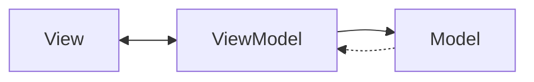
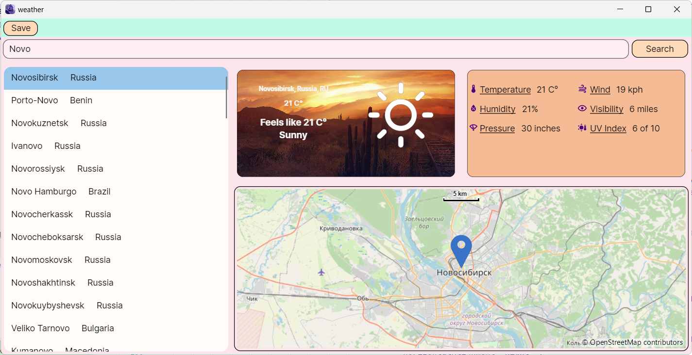
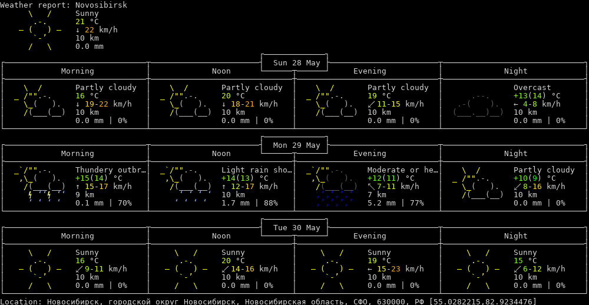

# Program description #
Software for determining the weather in the city. The [Avalonia](https://www.avaloniaui.net/) ased on the MVVM ([``Model-View-ViewModel``](https://en.wikipedia.org/wiki/Model%E2%80%93view%E2%80%93viewmodel)) design template was used for implementation.

## Weather API
The [wttr.in](https://github.com/chubin/wttr.in) is used to provide weather, which is  a console-oriented weather forecast service that supports various information representation methods like terminal-oriented ANSI-sequences for console HTTP clients (curl, httpie, or wget), HTML for web browsers, or PNG for graphical viewers.

## Example of using the program

### Current weather display

### Saving the weather for several days

